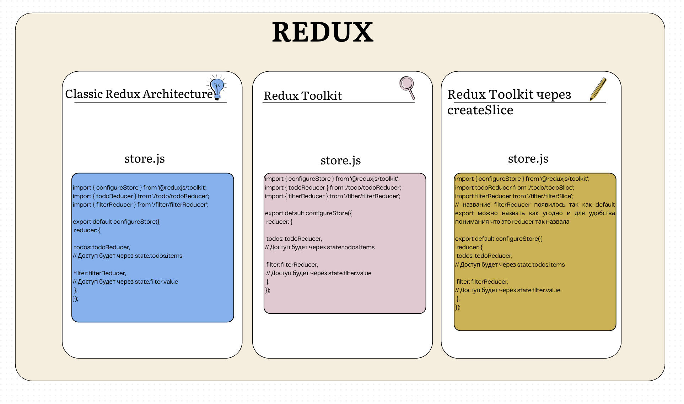
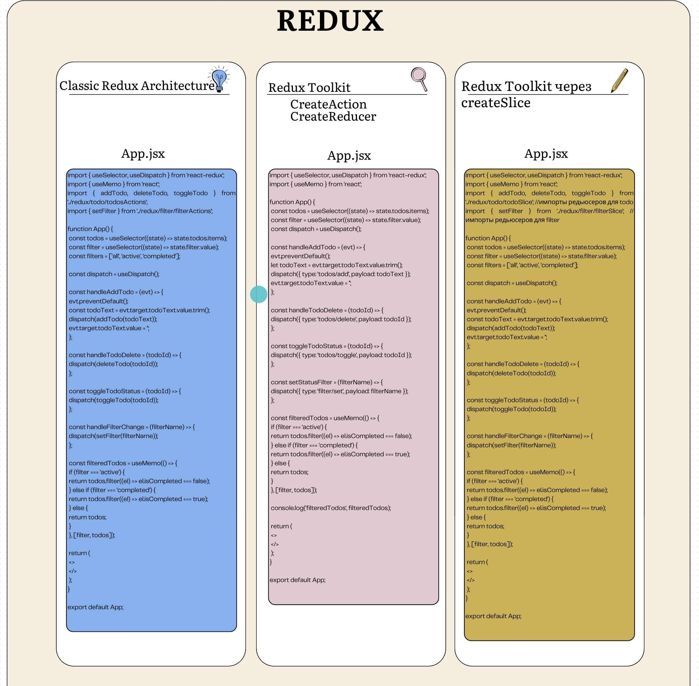

# React + Redux Toolkit — Todo Architecture Guide

Учебный проект Todo List для изучения разных подходов работы с Redux Toolkit.

В репозитории реализовано **3 архитектурных подхода Redux**:

| Ветка            | Подход                                             |
| ---------------- | -------------------------------------------------- |
| `main`           | Redux Toolkit через `createSlice`                  |
| `classic-redux`  | Классический Redux через `switch/case`             |
| `create-reducer` | Redux Toolkit через `createAction + createReducer` |

---

# Что реализовано в проекте

Во всех ветках используется:

- React
- Redux Toolkit
- React Redux
- Vite
- Todo List
- Фильтрация задач
- Добавление задач
- Удаление задач
- Изменение статуса задач

---

### 🚀 Сравнение реализаций Redux

<details>
  <summary>📂 Посмотреть сравнение архитектуры и файлов</summary>
  <br>
  
</details>

<details>
  <summary>⚙️ Посмотреть сравнение Store</summary>
  <br>
  
</details>

<details>
  <summary>⚙️ Посмотреть сравнение Actions и Reducers</summary>
  <br>
  
</details>

<details>
  <summary>💻 Посмотреть использование в App.jsx</summary>
  <br>
  
</details>

---

# Ветка main — createSlice

Современный и рекомендуемый подход Redux Toolkit.

Используется:

- configureStore
- createSlice
- reducers
- actions
- Immer
- useSelector
- useDispatch

## Особенности

`createSlice` автоматически:

- создает reducer
- создает actions
- генерирует action creators
- объединяет всю Redux-логику в одном файле

## Пример

```js
const todoSlice = createSlice({
  name: 'todos',
  initialState,
  reducers: {
    addTodo(state, action) {
      state.items.push({
        id: Date.now(),
        text: action.payload,
      });
    },
  },
});
```

## Структура

```txt
src/
  redux/
    store.js

    todo/
      todoSlice.js

    filter/
      filterSlice.js
```

---

# Ветка classic-redux — классический Redux

Базовый Redux-подход без helper-функций Redux Toolkit.

Используется:

- configureStore
- reducers
- switch/case
- dispatch
- useSelector
- useDispatch

## Особенности

Вся логика разделяется вручную:

- reducers
- actions
- action types

State обновляется только через immutable update.

## Пример

```js
const counterReducer = (state = initialState, action) => {
  switch (action.type) {
    case 'counter/increment':
      return {
        ...state,
        value: state.value + 1,
      };

    default:
      return state;
  }
};
```

## Структура

```txt
src/
  redux/
    store.js

    todo/
      todoReducer.js
      todoActions.js

    filter/
      filterReducer.js
```

---

# Ветка create-reducer — createAction + createReducer

Промежуточный подход Redux Toolkit.

Используется:

- configureStore
- createAction
- createReducer
- builder.addCase()
- Immer
- dispatch
- useSelector
- useDispatch

## Особенности

Actions и reducers разделены по разным файлам, но:

- switch/case уже не нужен
- Redux Toolkit автоматически помогает работать с immutable state
- используется builder.addCase()

## Пример createAction

```js
export const addTodo = createAction('todos/add');
```

## Пример createReducer

```js
const todoReducer = createReducer(initialState, (builder) => {
  builder.addCase(addTodo, (state, action) => {
    state.items.push({
      id: Date.now(),
      text: action.payload,
    });
  });
});
```

## Структура

```txt
src/
  redux/
    store.js

    todo/
      todoReducer.js
      todoActions.js

    filter/
      filterReducer.js
      filterActions.js
```

---

# Как создать проект

## 1. Создаем папку проекта

```bash
mkdir my-app
cd my-app
```

---

# 2. Создаем React проект через Vite

```bash
npm create vite@latest . -- --template react
```

---

# 3. Устанавливаем зависимости

```bash
npm install
```

---

# 4. Устанавливаем Redux Toolkit

```bash
npm install @reduxjs/toolkit react-redux
```

---

# Подключение Redux

## Создаем store.js

```js
import { configureStore } from '@reduxjs/toolkit';

export default configureStore({
  reducer: {},
});
```

---

# Подключаем Provider

```js
import { Provider } from 'react-redux';
import store from './redux/store';

<Provider store={store}>
  <App />
</Provider>;
```

---

# useSelector()

Позволяет получать данные из Redux store.

```js
const todos = useSelector((state) => state.todos.items);
```

---

# useDispatch()

Позволяет отправлять actions.

```js
const dispatch = useDispatch();
```

---

# Redux Flow

## 1. Компонент вызывает dispatch

```js
dispatch(addTodo('Изучить Redux Toolkit'));
```

↓

## 2. Action попадает в reducer

↓

## 3. Reducer обновляет state

↓

## 4. Redux обновляет store

↓

## 5. React автоматически обновляет UI

---

# Что важно понять новичку

Redux строится вокруг 3 вещей:

| Концепция | Описание                       |
| --------- | ------------------------------ |
| Store     | Глобальное хранилище состояния |
| Actions   | Описывают, что произошло       |
| Reducers  | Обновляют state                |

---

# Что такое immutable update

Redux state нельзя изменять напрямую.

❌ Неправильно:

```js
state.value++;
```

✅ Правильно:

```js
return {
  ...state,
  value: state.value + 1,
};
```

---

# Что изменил Redux Toolkit

Redux Toolkit:

✅ уменьшил количество boilerplate-кода
✅ убрал необходимость писать switch/case
✅ добавил Immer
✅ упростил архитектуру Redux
✅ сделал Redux более читаемым
✅ автоматизировал создание actions

---

# Как переключаться между ветками

## Посмотреть все ветки

```bash
git branch
```

---

## Переключиться на ветку

```bash
git checkout main
```

или:

```bash
git checkout classic-redux
```

или:

```bash
git checkout create-reducer
```

---

# Цель проекта

Проект создан как учебное сравнение:

- классического Redux
- createReducer
- createSlice

чтобы понять эволюцию Redux Toolkit и разницу архитектурных подходов.
